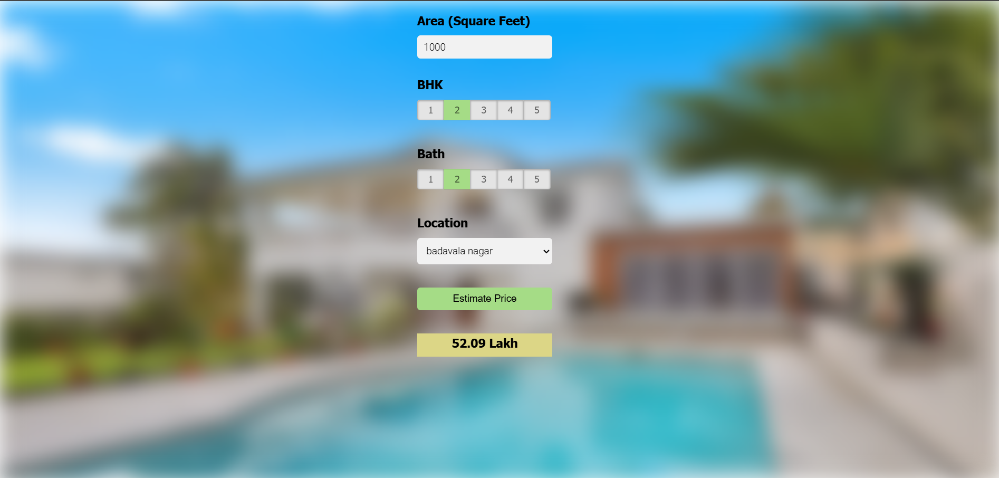

This is a real estate price prediction platform developed using **scikit-learn** and **linear regression** on the **Bangalore home prices dataset** from Kaggle. A **Python Flask server** was implemented to serve HTTP requests by utilizing the trained model. The front-end, built with **HTML, CSS, and JavaScript**, allows users to input property details (e.g., square footage, number of bedrooms) and fetch the predicted price via the Flask API. The project covers key data science concepts, including **data cleaning, outlier detection, feature engineering, dimensionality reduction, hyperparameter tuning (GridSearchCV), and K-fold cross-validation**. Technology and tools wise this project covers,

1. Python
2. Numpy and Pandas for data cleaning
3. Matplotlib for data visualization
4. Sklearn for model building
5. Jupyter notebook, visual studio code as IDE
6. Python flask for http server
7. HTML/CSS/Javascript for UI

How to run this project:
Install python packages and start flask server
```
sudo apt-get install python3-pip
sudo pip3 install -r /home/ubuntu/BangloreHomePrices/server/requirements.txt
python3 /home/ubuntu/BangloreHomePrices/client/server.py
```
Running last command above will prompt that server is running on port 5000.
Now just load your app.html in your local system and start predicting the prices!


